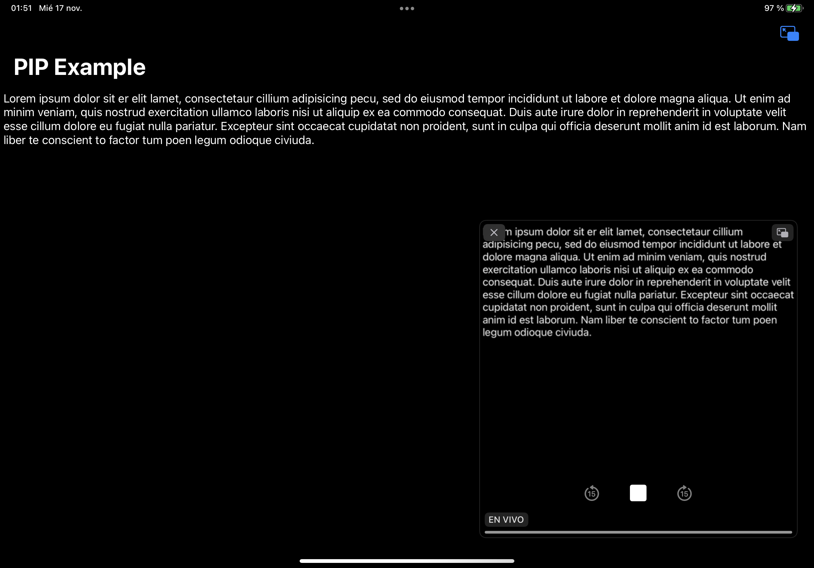

# Pipable

Pipable is an iOS library to implement Picture in Picture for any `UIView`. This is done just by conforming to a protocol.

The "Audio, AirPlay and Picture in Picture" background mode must be enabled and an audio session must be active for PIP to work.

Requires iOS / iPadOS 15+.



## Usage

Create a `UIView` that conforms to `Pipable`. Start an audio session and then use the `pictureInPictureController` object automatically provided by the `Pipable` protocol to start PIP.

```swift
import Pipable
import UIKit
import AVKit

class MyTextView: UITextView, Pipable {

    var pictureInPictureDelegate: PictureInPictureDelegate?
    
    var previewSize: CGSize {
        CGSize(width: 512, height: 512)
    }
    
    func willTakeSnapshot() {
    }
    
    func didTakeSnapshot() {
    }
}

let textView = MyTextView()
textView.text = "Hello World!"

// Update the snapshot (do this everytime the text is changed)

textView.updatePictureInPictureSnapshot()

// Start an audio session

do {
    try AVAudioSession.sharedInstance().setCategory(.playback)
    try AVAudioSession.sharedInstance().setActive(true, options: [])
} catch {
    print(error.localizedDescription)
}

// Start PIP

textView.pictureInPictureController?.startPictureInPicture()
```
